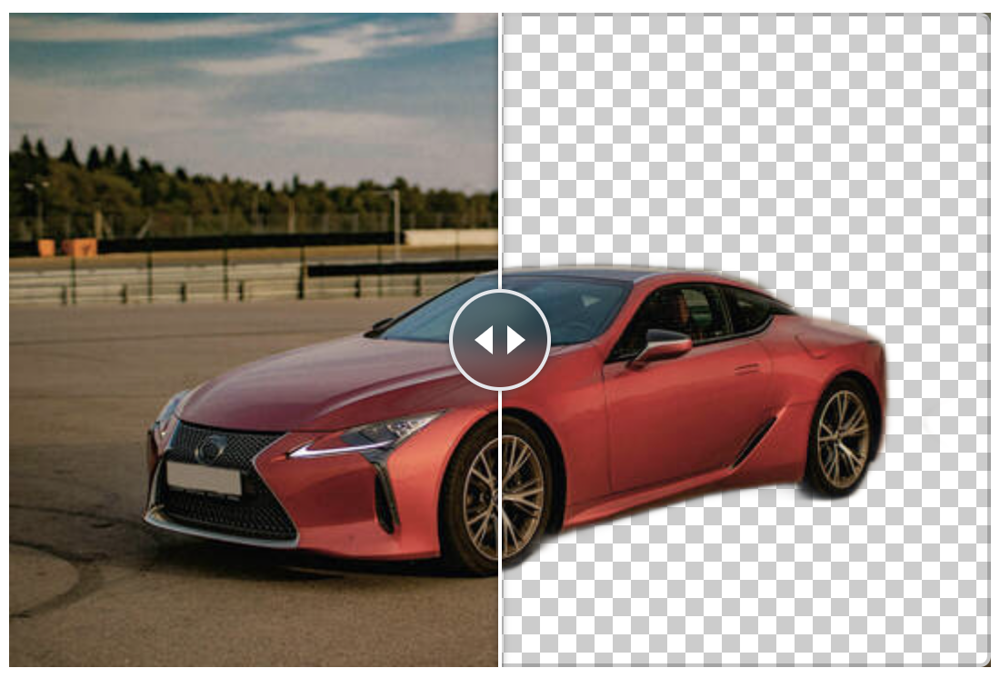

# <div style="display: flex; justify-content: center;">remove-bg</div>

### <div align="center"><b><a href="README.md">English</a> | <a href="README_CN.md">简体中文</a></b></div>

<div align="center">

[](https://github.com/reamd/remove-bg/releases)

[](https://github.com/reamd/remove-bg/issues)

[](https://github.com/reamd/remove-bg/issues)

[](https://github.com/reamd/remove-bg/blob/master/LICENSE)

</div>

> :rocket:基于WebGPU和WebAssembly (WASM)，实现抠图工具，图片在用户浏览器本地离线运行，无需担心隐私风险。

<div align="center">

</div>

### 体验网址

[https://reamd.github.io/remove-bg](https://reamd.github.io/remove-bg)

## :computer:如何使用

### 本地运行模式

1. 克隆仓库

```bash
git clone https://github.com/reamd/remove-bg.git
cd remove-bg
```

2. 安装依赖

```bash
npm install
```

3. 运行Web应用

```bash
npm run start
```

### Docker模式

1. 克隆仓库

```bash
git clone https://github.com/reamd/remove-bg.git
cd remove-bg
```

2. 运行Docker

```bash
docker run -d -p 8080:80
```

## :star:联系我

如果你有任何问题，请关注我的`X`或微信公众号:

- [](https://x.com/DJ_wilderness)

- 微信公众号
  

## :information_desk_person:致谢

模型: [xuebinqin/U-2-Net](https://github.com/xuebinqin/U-2-Net)

### 引用

```
@InProceedings{Qin_2020_PR,
title = {U2-Net: Going Deeper with Nested U-Structure for Salient Object Detection},
author = {Qin, Xuebin and Zhang, Zichen and Huang, Chenyang and Dehghan, Masood and Zaiane, Osmar and Jagersand, Martin},
journal = {Pattern Recognition},
volume = {106},
pages = {107404},
year = {2020}
}
```
